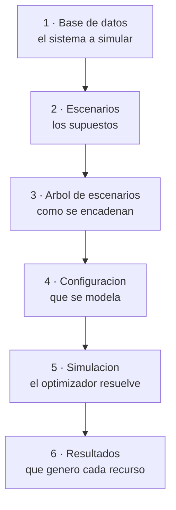

# Ciclo de una simulación

Cada nodo del diagrama enlaza a la sección que lo explica.

<!--
  Los seis "click" de abajo llevan el prefijo de base "/thori-docs" escrito a mano
  porque mermaid no admite `withBase`. Si `base` cambia en docs/.vitepress/config.mts
  (por ejemplo al mudar el sitio a un dominio propio), estos seis enlaces quedan
  apuntando a una ruta vieja y ningún chequeo de build lo va a detectar: revisarlos
  a mano en ese momento.
-->

## 1. Base de datos

Describe el sistema: recursos de generación, embalses, red hidráulica, demanda,
combustibles. Es lo que no cambia entre escenarios.

## 2. Escenarios

Los supuestos sobre lo incierto: aportes hídricos, demanda, disponibilidad.

## 3. Árbol de escenarios

Encadena los escenarios a lo largo de las etapas, de modo que cada rama sea una
evolución posible del sistema.

## 4. Configuración

Las banderas deciden qué restricciones se imponen. Cambiarlas cambia el problema que
se resuelve, no solo su solución.

## 5. Simulación

El optimizador busca el despacho de menor costo que cumple todas las restricciones
activas, para todas las etapas y bloques del horizonte.

## 6. Resultados

Generación por recurso, evolución de los embalses, consumo de combustible,
intercambios entre áreas y costo total del sistema.
