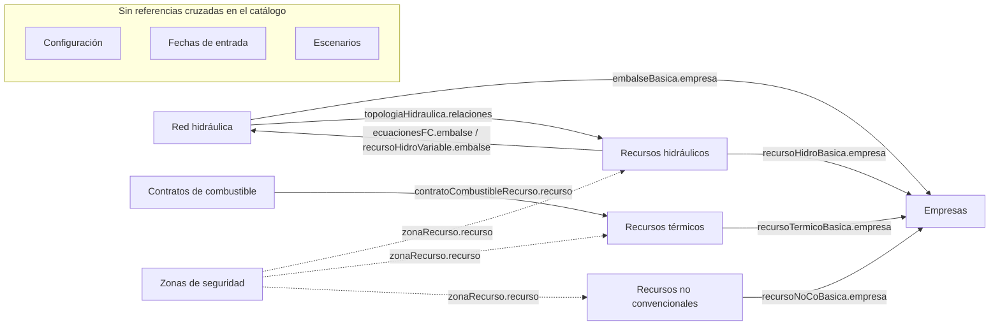
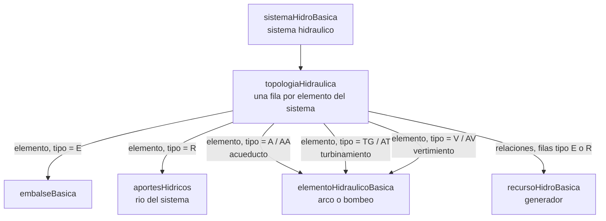

# Modelo de datos

El caso que se simula se describe con {{ tablas.length }} tablas. Están agrupadas por
familia; cada tabla documenta sus campos, su tipo y su unidad.

## Cómo se conectan las familias

Cada campo de cada tabla puede declarar, en el catálogo, una referencia real a otra
tabla — es la columna "Referencia" que aparece en la página de cada tabla. Casi toda
familia con variación por etapa tiene además una tabla `*Periodo` que referencia
genéricamente a `periodoBasica`: un patrón que se repite en once de las catorce
familias y que no se dibuja abajo para no repetir la misma arista once veces. Áreas y
Recursos no convencionales, además, tienen una tabla que referencia a `bloqueBasica`.
Áreas, Bloques, Combustibles y Periodos no aparecen en el diagrama porque esa
referencia genérica es la única que tienen: no hay ninguna arista sustantiva que
dibujar para ellas aparte de esa.

Una flecha "A → B" significa que un campo de una tabla de la familia A referencia a
una tabla de la familia B. Las flechas punteadas de Zonas son polimórficas:
`zonaRecurso.recurso` puede apuntar a un recurso hidráulico, térmico o no
convencional — el catálogo lo documenta como `referencia: null` a propósito, porque
el manual no distingue de cuál de las tres tablas proviene.

## Topología de la red hidráulica

`topologiaHidraulica` es la tabla puente de la familia Red hidráulica: una fila por
elemento de cada sistema, clasificada por `tipo`. Según el valor de `tipo`, la columna
`elemento` de esa fila apunta a una tabla distinta; la columna `relaciones` (solo en
filas de tipo `E` o `R`) apunta además a los generadores asociados a ese embalse o río.

| `tipo` | Significado |
|---|---|
| `E` | Embalse asociado al sistema |
| `R` | Río asociado al sistema |
| `A` | Salida de acueducto |
| `AA` | Entrada de acueducto aguas arriba |
| `TG` | Salida de turbinamiento |
| `AT` | Entrada de turbinamiento aguas arriba |
| `V` | Salida de vertimiento |
| `AV` | Entrada de vertimiento aguas arriba |

<ExploradorTablas />

  <h2>{{ ETIQUETAS_FAMILIA[familia] ?? familia }}</h2>
  <ul>
    <li v-for="t in items" :key="t.id">
      <a :href="withBase(`/despacho-hidrotermico/datos/${t.id}`)">{{ t.titulo }}</a>
      — <code>{{ t.nombre }}</code>
    </li>
  </ul>

